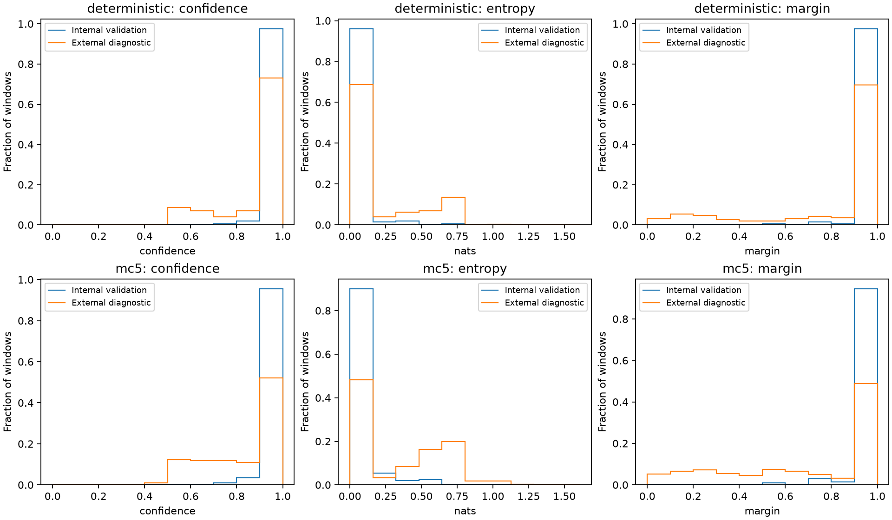

# External uncertainty comparison

Model: `gesture-model-v1.1.0`; SHA-256 `4891b4b6d453d96852ddcaea35d847ff8eea4ef1349ae999d7594925dabc5d6c`.

Reference: 200 dataset-v1 validation windows from `session_02`.
External: 1100 diagnostically adapted windows; native compatibility is false.

Deterministic mode disables dropout. MC5 averages five stochastic head predictions with dropout rate 0.2 and seed 42.
Entropy is predictive entropy of the probability vector (MC mean in MC5), in nats. Margin is the top-two probability difference.
Probability sums are normalized for floating-point roundoff only. No temperature scaling, training or calibration is performed.

| Mode | Cohort | Mean confidence | Mean entropy (nats) | Mean margin |
|---|---|---:|---:|---:|
| deterministic | internal | 0.993417 | 0.029375 | 0.987796 |
| deterministic | external | 0.910486 | 0.182357 | 0.823201 |
| mc5 | internal | 0.985874 | 0.059807 | 0.974035 |
| mc5 | external | 0.848933 | 0.315001 | 0.706843 |

## Label-controlled idle comparison

Only broad idle semantics are mapped. This subset is not an overall gesture-accuracy test.

| Mode | Internal IDLE mean confidence / entropy | External idle mean confidence / entropy | Mapped idle accuracy | Confident mapped errors (confidence >= 0.9) |
|---|---|---|---:|---:|
| deterministic | 0.995815 / 0.020924 | 0.718562 / 0.547137 | 0.000000 | 46 / 300 |
| mc5 | 0.988711 / 0.058798 | 0.707812 / 0.577194 | 0.000000 | 36 / 300 |

## MC5 distribution by original external label

| Label | N | Mean confidence | Mean entropy (nats) | Mean margin |
|---|---:|---:|---:|---:|
| flick_down | 200 | 0.797127 | 0.450408 | 0.604235 |
| flick_up | 200 | 0.837438 | 0.355454 | 0.696588 |
| idle | 300 | 0.707812 | 0.577194 | 0.426581 |
| wave_left | 200 | 0.997567 | 0.005443 | 0.995152 |
| wave_right | 200 | 0.975282 | 0.055408 | 0.951791 |

## Histogram counts

Bins are left-inclusive/right-exclusive except the final bin, which includes its right endpoint.

### deterministic: confidence

| Bin | Internal count | External count |
|---|---:|---:|
| 0.000000 to 0.100000 | 0 | 0 |
| 0.100000 to 0.200000 | 0 | 0 |
| 0.200000 to 0.300000 | 0 | 0 |
| 0.300000 to 0.400000 | 0 | 0 |
| 0.400000 to 0.500000 | 0 | 1 |
| 0.500000 to 0.600000 | 0 | 96 |
| 0.600000 to 0.700000 | 0 | 77 |
| 0.700000 to 0.800000 | 1 | 45 |
| 0.800000 to 0.900000 | 4 | 78 |
| 0.900000 to 1.000000 | 195 | 803 |

### deterministic: entropy

| Bin | Internal count | External count |
|---|---:|---:|
| 0.000000 to 0.160944 | 192 | 756 |
| 0.160944 to 0.321888 | 3 | 43 |
| 0.321888 to 0.482831 | 4 | 68 |
| 0.482831 to 0.643775 | 0 | 76 |
| 0.643775 to 0.804719 | 1 | 149 |
| 0.804719 to 0.965663 | 0 | 2 |
| 0.965663 to 1.126607 | 0 | 4 |
| 1.126607 to 1.287550 | 0 | 1 |
| 1.287550 to 1.448494 | 0 | 1 |
| 1.448494 to 1.609438 | 0 | 0 |

### deterministic: margin

| Bin | Internal count | External count |
|---|---:|---:|
| 0.000000 to 0.100000 | 0 | 34 |
| 0.100000 to 0.200000 | 0 | 59 |
| 0.200000 to 0.300000 | 0 | 51 |
| 0.300000 to 0.400000 | 0 | 29 |
| 0.400000 to 0.500000 | 0 | 22 |
| 0.500000 to 0.600000 | 1 | 22 |
| 0.600000 to 0.700000 | 0 | 33 |
| 0.700000 to 0.800000 | 3 | 47 |
| 0.800000 to 0.900000 | 1 | 38 |
| 0.900000 to 1.000000 | 195 | 765 |

### mc5: confidence

| Bin | Internal count | External count |
|---|---:|---:|
| 0.000000 to 0.100000 | 0 | 0 |
| 0.100000 to 0.200000 | 0 | 0 |
| 0.200000 to 0.300000 | 0 | 0 |
| 0.300000 to 0.400000 | 0 | 0 |
| 0.400000 to 0.500000 | 0 | 12 |
| 0.500000 to 0.600000 | 0 | 134 |
| 0.600000 to 0.700000 | 0 | 131 |
| 0.700000 to 0.800000 | 2 | 131 |
| 0.800000 to 0.900000 | 7 | 120 |
| 0.900000 to 1.000000 | 191 | 572 |

### mc5: entropy

| Bin | Internal count | External count |
|---|---:|---:|
| 0.000000 to 0.160944 | 180 | 530 |
| 0.160944 to 0.321888 | 11 | 36 |
| 0.321888 to 0.482831 | 4 | 92 |
| 0.482831 to 0.643775 | 5 | 179 |
| 0.643775 to 0.804719 | 0 | 220 |
| 0.804719 to 0.965663 | 0 | 19 |
| 0.965663 to 1.126607 | 0 | 19 |
| 1.126607 to 1.287550 | 0 | 4 |
| 1.287550 to 1.448494 | 0 | 1 |
| 1.448494 to 1.609438 | 0 | 0 |

### mc5: margin

| Bin | Internal count | External count |
|---|---:|---:|
| 0.000000 to 0.100000 | 0 | 57 |
| 0.100000 to 0.200000 | 0 | 72 |
| 0.200000 to 0.300000 | 0 | 79 |
| 0.300000 to 0.400000 | 0 | 59 |
| 0.400000 to 0.500000 | 0 | 49 |
| 0.500000 to 0.600000 | 2 | 83 |
| 0.600000 to 0.700000 | 0 | 73 |
| 0.700000 to 0.800000 | 6 | 54 |
| 0.800000 to 0.900000 | 3 | 36 |
| 0.900000 to 1.000000 | 189 | 538 |

## Interpretation and limits

deterministic: external minus internal mean entropy = 0.152981 nats; mean confidence difference = -0.082931.
mc5: external minus internal mean entropy = 0.255193 nats; mean confidence difference = -0.136941.
The mapped-subset table reports high-confidence errors explicitly. Confidence alone is not a correctness guarantee under shift.
This is descriptive evidence for a robustness stress test; it does not validate an OOD detector or an adaptive-policy threshold.
Class balance, gesture semantics, sampling adaptation, unknown mounting and acquisition differences confound pooled comparisons.
MC masks are host-side analysis masks, not firmware parity vectors. No ESP32 test, policy training or production change was performed.

Input report SHA-256 (LF UTF-8): `654fa4dcd5c2e01fc87a44474828e5d140440dc1555b443ea6cc19ca84ac82a4`.
